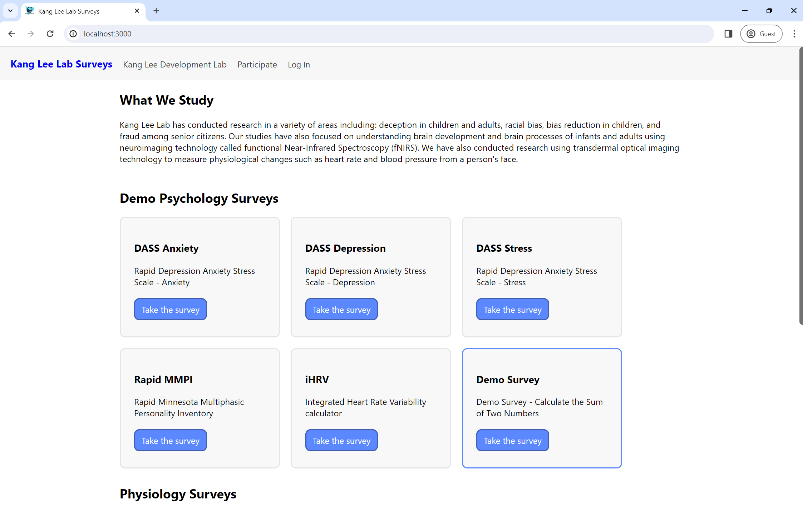
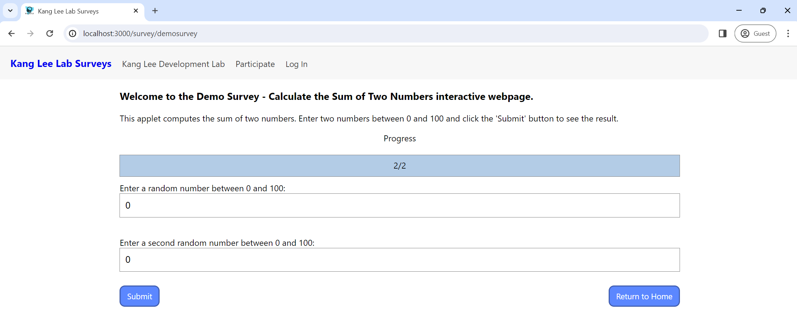
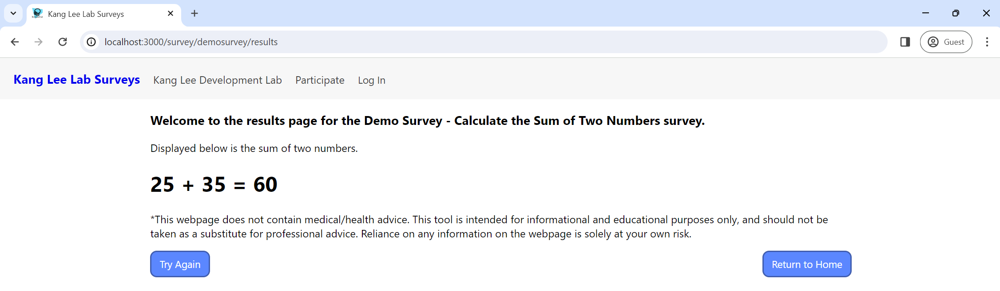
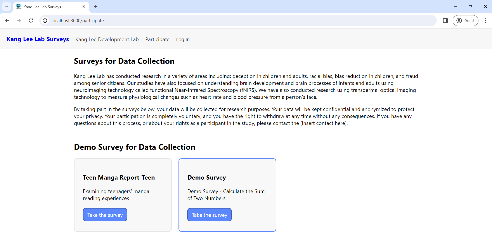
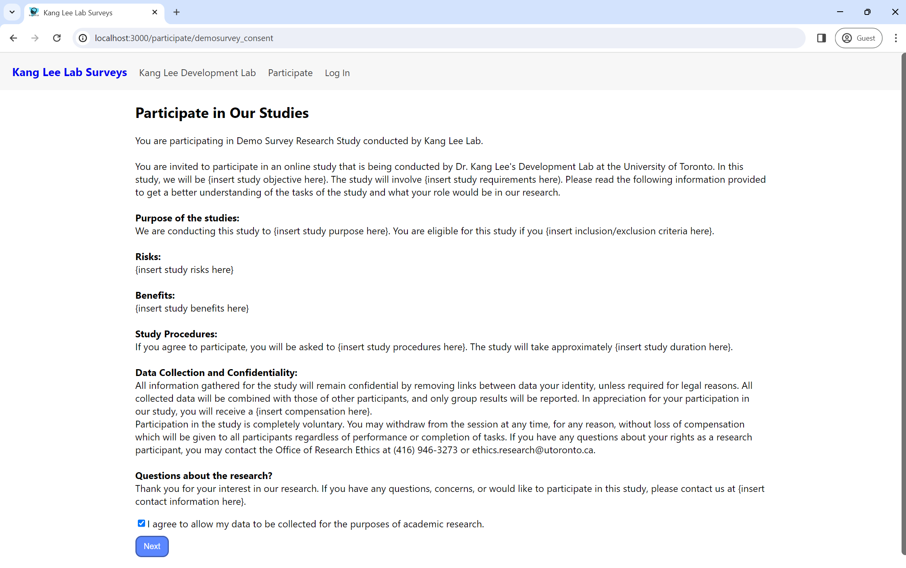

# Kang Lee Lab Surveys — Backend

Django API for the Kang Lee Lab Surveys website. See the [repository root README](../README.md) for full monorepo setup.

## Running locally

From the `backend/` directory:

1. `pip install -r requirements.txt`
2. `docker compose up -d postgres` from the repository root, for the local database
3. `python manage.py migrate`
4. `python manage.py runserver`

Note that ASQ, DASS, MMPI, NAFLD and Child BMI only work under `docker compose
up` from the repository root: their models were pickled under scikit-learn 1.0.2
and cannot be unpickled by the 1.4.2 pinned here, so a native server returns a
500 for them. See the [root README](../README.md#backend-and-database-docker--the-normal-path).

## API authentication

Auth0 access tokens, RS256, verified against the tenant JWKS. Set `AUTH0_DOMAIN`
and `AUTH0_AUDIENCE` in `backend/.env`; `AUTH0_AUDIENCE` must match the
frontend's `REACT_APP_AUTH0_AUDIENCE` exactly.

Decorators are in `labsurveysbackend/auth0.py`. An undecorated route is public.

| Tier | Decorator | Routes |
|------|-----------|--------|
| Public | — | `GET /`, `/surveys/`, `/surveys/wakeup`, `/surveys/catalog`, `/surveys/survey/<id>`, `/surveys/participate/<id>` |
| Optional | `@optional_auth` | `POST /surveys/results` |
| Protected | `@require_auth` | `GET /surveys/me`, `GET /surveys/participants/me/responses` |
| Staff | `@require_permission("read:responses")` | `GET /surveys/history`, `/surveys/history/<type>/`, `/surveys/download-csv` |

On the optional tier, no token means guest; an invalid token is still a 401.

| Status | Meaning |
|--------|---------|
| 401 | missing, malformed, expired or forged token |
| 403 | valid token, account lacks the permission |
| 503 | Auth0 JWKS unreachable |
| 500 | `AUTH0_DOMAIN` / `AUTH0_AUDIENCE` not set |

`GET /surveys/me` returns `{sub, email, permissions}` and touches no database —
use it to check a token.

### Granting staff access

Auth0 dashboard, under **Applications → APIs → `urn:lab-surveys-backend`**:

1. **Permissions** — add `read:responses`.
2. **Settings** — enable **RBAC** and **Add Permissions in the Access Token**.
3. **User Management → Roles** — create `lab-admin`, give it `read:responses`,
   assign it to each staff account.

Without step 2 no token carries permissions and the staff routes return 403 for
everyone, including admins.

## Database

Two tables. Run `python manage.py migrate` after pulling.

```
surveys_participant                    surveys_response
────────────────────────               ─────────────────────────────
id          bigint PK ◄────────┐       id                 int PK
auth0_sub   varchar(255) UNIQUE└───────participant_id     bigint FK, nullable
email       varchar(254) nullable       response_type     varchar(100)
created_at  timestamptz                 response_answers  jsonb
updated_at  timestamptz                 response_results  jsonb
                                        response_date     date
                                        response_time     time
                                        response_duration interval
```

- A participant row is created on the first authenticated request for an unseen
  Auth0 `sub`. There is no registration step.
- `POST /surveys/results` stores a response only when the caller is signed in.
  Anonymous submissions return results and are not stored.
- `participant_id` is null only on rows predating sign-in. Deleting a
  participant cascades to their responses.
- `email` fills in only if the access token carries an email claim, which Auth0
  does not include by default.
- `GET /surveys/participants/me/responses` is scoped to the caller's token.

## Tests

```bash
python manage.py test
```

Runs offline — no Auth0 tenant or network needed. Backend CI runs them.

## Development

Please download the 'Prettier - Code formatter' extension on VSCode so we can keep our formatting consistent. This also reduces conflicts when committing code since it'll adjust spacing, tabbing, etc for us.

## Adding a New Survey Page
The following guide outlines the steps required to add a new survey to the Kang Lee Surveys website.

### Prerequisites
Ensure that you have the development environment set up for both the frontend and backend. See the [repository root README](../README.md).

### Step 1: Add a new survey card to the homepage. 
1. Identify the {surveytype} you would like to add: psychology, physiology, or physical survey.
2. Under the frontend/src/data/ folder, open the {surveytype}-surveys.json file. For example, to add a new psychology survey, open the psychology-surveys.json file.
3. In the {survey type}-surveys.json file, add a new object to the array with the following format:
    ```jsx
    {
        "title": "Demo Survey",
        "description": "Demo Survey - Calculate the Sum of Two Numbers",
        "link": "demosurvey" // this is the {surveylink} referenced in the following steps
    }
    ```
This will add a new card to the homepage under the appropriate subheading. The card includes a button that directs users to http://localhost:3000/survey/{surveylink}, which contains the questions for the associated survey. 



### Step 2: Create a survey page.
1. Create a new folder in backend/surveys/static/survey_files/ named {surveylink}. In the previous example, the folder would be named demosurvey.
2. Inside the new folder, create three files with the following names: {surveylink}.json, metadata_EN.json, results_EN.json.
3. In the {surveylink}.json file, define the questions and answer options for the survey by adding the object below and editing as necessary: 
    ```jsx
    {
        "survey_id": "demosurvey", //{surveylink}
        "language": "EN",
        "survey_mode": "",
        "title": "Demo Survey - Calculate the Sum of Two Numbers",
        "description": {
            "p1": "This applet computes the sum of two numbers. Enter two numbers between 0 and 100 and click the 'Submit' button to see the result."
    },
        "pages": [
            {
                "page_order": "0",
                // the following object defines the questions and answer options for the survey
                "questions": [
                    {
                        "question_id": "Number1",
                        "question_text": "Enter a random number between 0 and 100:",
                        "question": {
                            "type": "number",
                            "default_value": 0,
                            "step": 1,
                            "min": 0,
                            "max": 100
                        },
                        "is_required": true
                    },
                    {
                        "question_id": "Number2",
                        "question_text": "Enter a second random number between 0 and 100:",
                        "question": {
                            "type": "number",
                            "default_value": 0,
                            "step": 1,
                            "min": 0,
                            "max": 100
                        },
                        "is_required": true
                    }
                ]
            }
        ]
    }
    ```
    The "type" field determines the type of input the user will provide (e.g. dropdown selection, number). You can add additional questions by adding more objects to the "questions" array. To view all the available question types and their properties, refer to the questions.json file in the backend/surveys/static/schemas folder.

4. In the metadata_EN.json file, add the following object and edit each field as necessary:
    ```jsx
    {
    "survey_id": "demosurvey",
    "language": "EN",
    "short_name": "Demo Survey",
    "full_name": "Demo Survey - Calculate the Sum of Two Numbers",
    "description": "This applet computes the sum of two numbers.",
    "survey_type": "psychological", // choose 1 of 3: psychological, physiological, or physical
    "display": false,
    "is_data_collection": false,
    "turn_off_data_collection": true,
    "has_results": true,
    "is_machine_learning": false, // if true, the survey will include a machine learning model
    "instructions": "Please enter your answers below:"
    }
    ```
    For more information on the metadata fields, refer to the metadata_EN.json file in the backend/surveys/static/schemas folder.

5. In the results_EN.json file, add the following object and edit each field as necessary:
    ```jsx
    {
    "survey_id": "demosurvey", // {surveylink}
    "language": "EN",
    "results": [
        {
            "result_id": "sum", // unique identifier for the result
            "result_name": "Sum", // name of the result
            "result_text": "Sum of two numbers", // description of the result
            "result": {
                "type": "scalar", // define result type (e.g. scalar, text) and limits
                "value": 10,
                "value_lower_bound": 0,
                "value_upper_bound": 1000,
                "is_reverse_order": false,
                "use_dial": false
            }
        }
    ],
    "use_multiedged_graph": false,
    "use_table": false,
    "final_message": "Displayed is the sum of two numbers.\n*This webpage does not contain medical/health advice. This tool is intended for informational and educational purposes only, and should not be taken as a substitute for professional advice. Reliance on any information on the webpage is solely at your own risk." // final message after the result
    }
    
    For more information on the results fields, refer to the results_EN.json file in the backend/surveys/static/schemas folder.

6. Optional: If you indicated "is_machine_learning" as true in the metadata_EN.json file, include the machine learning model .bin file to the backend/surveys/static/survey_files/{surveylink} folder.

7. Open the backend/surveys/views.py file. Under the ```get_survey_file_path``` function, add a new elif statement to return the file path for the new survey. For example:

    ```python
    @csrf_exempt
    def get_survey_file_path(survey_folder: str) -> str:
        if survey_folder == "asq":
            return "surveys/static/survey_files/asq/asq.json"
        elif survey_folder == "child_bmi":
            return "surveys/static/survey_files/child_bmi/child_bmi.json"
        elif survey_folder == "depression_moderate":
            return "surveys/static/survey_files/dass/depression_moderate.json"
        elif survey_folder == "anxiety_moderate":
            return "surveys/static/survey_files/dass/anxiety_moderate.json"
        elif survey_folder == "stress_moderate":
            return "surveys/static/survey_files/dass/stress_moderate.json"
        elif survey_folder == "mmpi":
            return "surveys/static/survey_files/mmpi/mmpi.json"
        elif survey_folder == "nafld":
            return "surveys/static/survey_files/nafld/nafld.json"
        elif survey_folder == "manga":
            return "surveys/static/survey_files/manga/manga.json"
        elif survey_folder == "demosurvey": # insert new elif survey with {surveylink} here
            return "surveys/static/survey_files/demosurvey/demosurvey.json" # follow format: "surveys/static/survey_files/{surveylink}.json"
        else:
            raise ValueError("Invalid survey type")
        ```

This will create a new survey page with the specified questions and options. The survey page will be accessible using the following URL: http://localhost:3000/survey/{surveylink}.



### Step 3: Define how survey results are calculated.
1. Create a new folder in backend/surveys/utils/ named {surveylink}.
2. Inside the new folder, create a .py file containing functions to calculate the survey results. For example, to calculate the sum of two numbers, we can create a file named calculate.py with the following content:
    ```python
    """
    This file contains the functions that calculate the sum of two numbers for
    the demo survey.
    """

    def calculate_sum(a: int, b: int) -> int:
        """
        Calculates the sum of two numbers.
        :param a: first number
        :param b: second number
        :return: sum of a and b
        """
        return a + b
    ```

3. Inside the new folder, create a {surveylink}_survey.py file. Inside this file, define a function ```{surveylink}_calculate_results``` used to receive survey responses as input and output the results in the specified format. The results should be calculated using the functions in the .py file created in step 2. Following the previous example, we can create a file named demosurvey_survey.py and add the following content:
    ```python
    """
    Template for the functions related to demo survey.
    """
    import json
    from typing import Any, Dict, Tuple, List
    from jsonschema import validate
    from surveys.utils.helpers import get_survey_result_schemas, convert_values_to_floats
    from surveys.utils.demosurvey.calculate import calculate_sum # import the calculate_sum function from the calculate.py file

    SURVEY_FOLDER = "demosurvey" # {surveylink}

    # define a function to calculate the survey results
    def demosurvey_calculate_results(
        answers: Dict[str, Any], language: str = "EN"
    ) -> Tuple[str, Any, float]:
        """
        Function to calculate the sum of two numbers for the demo survey.

        Arguments:
            answers (list[float]): Survey answers
            language (str): Language of the website
        Outputs:
            results (str): Survey results json formatted according to the schema
            metadata (Any): Survey metadata json formatted according to the schema
            demosurvey_result (float): demosurvey result
            number1 (float): First number from survey
            number2 (float): Second number from survey
        """
        results_schema, metadata, metadata_schema = get_survey_result_schemas(SURVEY_FOLDER, language)
        demosurvey_data_floats = convert_values_to_floats(answers)
        number1 = demosurvey_data_floats["Number1"]
        number2 = demosurvey_data_floats["Number2"]
        demosurvey_result = calculate_sum(demosurvey_data_floats["Number1"], demosurvey_data_floats["Number2"])
        results = json.dumps(demosurvey_result)
        validate(results, results_schema)
        validate(metadata, metadata_schema)

        return results, metadata, demosurvey_result, number1, number2
    ```

4. Open the `backend/surveys/views.py` file.
- In the import statements at the top of the file, add an import statement for the new `{surveylink}_calculate_results` function. For example, following the previous example:
    ```python
    from surveys.utils.demosurvey.demosurvey_survey import demosurvey_calculate_results # follow format: from surveys.utils.{surveylink}.{surveylink}_survey import {surveylink}_calculate_results
    ```

- Under the calculate_results function, add a new elif statement to call the new `{surveylink}_calculate_results` function. For example, following the previous example:
    ```python
    elif request_body["survey"] == "demosurvey": # {surveylink}
        results, metadata, demosurvey_result, number1, number2 = demosurvey_calculate_results(
            request_body["data"], "EN"
        )
        # insert code to add results to data dictionary, which will be called from the frontend to display results
        data["number1"] = number1
        data["number2"] = number2
        data["sum_result"] = demosurvey_result
        # insert code to add results to the database
        data["db_result"] = {"Sum": demosurvey_result}
    ```

### Step 4: Create a results page.
1. Open the frontend/src/pages/ResultsPage/ResultsPage.jsx file. 
2. Inside the ResultsPage function, add a new conditional rendering block for your survey named {surveylink}, similar to the existing blocks for "dass", "nafld", "mmpi", etc.
3. Inside the block, define the layout and components that should be displayed to interpret the survey results. This may include text, tables, charts, etc., depending on the nature of your survey results. You can use the existing blocks as a reference for how to structure the results page. For example, following the previous example:
    ```jsx
    {surveyId === "demosurvey" && (
       <div>
         <p>
           Displayed below is the sum of two numbers.
         </p>
         <h1> {data.number1} + {data.number2} =  {data.sum_result} </h1>
       </div>
    )}
    ```
This will create a new results page with the specified layout and components. The results page will be accessible using the following URL: http://localhost:3000/survey/{surveylink}/results.



### Step 5 (Optional): Create a survey for data collection with a consent form.
The following steps outline how to create a survey with a consent form under the "Participate" tab. This is useful for studies that require participants to provide informed consent before completing the survey.
1. Under the frontend/src/data folder, open the data-collection-surveys.json file.
2. In the data-collection-surveys.json file, add a new object to the array with the following format:

```jsx
  {
    "key": "Demo Survey",
    "title": "Demo Survey",
    "description": "Demo Survey - Calculate the Sum of Two Numbers",
    "link": "demosurvey" // {surveylink}
  }
```
This will create a new survey card under the "Participate" tab. The card includes a button that directs users to http://localhost:3000/participate/{surveylink}_consent, which contains the consent form for the associated survey.



2. Under the backend/surveys/static/survey_files/{surveylink} folder, create a new file named {surveylink}-consent.json.
3. In the {surveylink}-consent.json file, add the following object and edit each field as necessary. Following the previous example:
    ```jsx
    {
    "consent_id": "demosurvey", // {surveylink}
    "title": "Demo Survey Research Study",
    "introduction": "You are invited to participate in an online study that is being conducted by Dr. Kang Lee's Development Lab at the University of Toronto. In this study, we will be {insert study objective here}. The study will involve {insert study requirements here). Please read the following information provided to get a better understanding of the tasks of the study and what your role would be in our research.",
    "purpose":"We are conducting this study to {insert study purpose here}. You are eligible for this study if you {insert inclusion/exclusion criteria here}.",
    "risks": "{insert study risks here}",
    "benefits": "{insert study benefits here}",
    "procedures": "If you agree to participate, you will be asked to {insert study procedures here}. The study will take approximately {insert study duration here}.",
    "voluntary": "Participation in the study is completely voluntary. You may withdraw from the session at any time, for any reason, without loss of compensation which will be given to all participants regardless of performance or completion of tasks. If you have any questions about your rights as a research participant, you may contact the Office of Research Ethics at (416) 946-3273 or ethics.research@utoronto.ca.",
    "confidentiality": "All information gathered for the study will remain confidential by removing links between data your identity, unless required for legal reasons. All collected data will be combined with those of other participants, and only group results will be reported. In appreciation for your participation in our study, you will receive a {insert compensation here}.",
    "contact": "Thank you for your interest in our research. If you have any questions, concerns, or would like to participate in this study, please contact us at {insert contact information here}. "
    }
    ```

Ths will create a new consent form for the survey. The consent form will be accessible using the following URL: http://localhost:3000/participate/{surveylink}_consent. Upon submission, the participant will be directed to http://localhost:3000/survey/{surveylink} to complete the survey.

